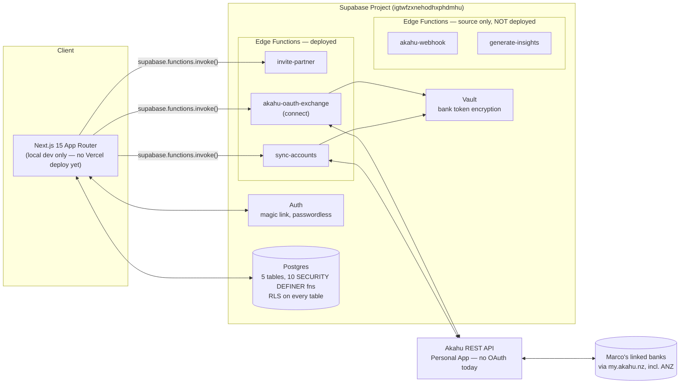

# Household Ledger — Technical Handover

**As of:** Milestone 5 approved (bank connection foundation), before Milestone 6 (transaction import)
**Status:** Local development only — not yet deployed to Vercel
**Repo:** `Spinelli09/togetherapp` · Supabase project: `togetherapp` (`igtwfzxnehodhxphdmhu`)

Every fact below was re-verified against the live database, deployed functions, and repo contents while writing this document, not recalled from memory.

---

## 1. Current architecture

**What this diagram deliberately does NOT show:** a dashboard aggregation layer, a transactions table, budgets, goals, bills, or AI insights — none of that exists yet. `/` is still the Milestone 3 placeholder page.

---

## 2. Database schema summary

All 5 tables have RLS enabled, no exceptions.

| Table | Rows today | Key columns | RLS shape |
|---|---|---|---|
| `households` | 1 (real: Marco's) | `id`, `name`, `created_at` | Members SELECT; owner UPDATE; any authenticated user INSERT (bootstrap case, documented) |
| `household_members` | 1 | `household_id`, `user_id`, `display_name`, `role` (owner\|member) | Members SELECT co-members; self-only INSERT/UPDATE |
| `household_invites` | 0 | `household_id`, `email`, `token` (unique), `invited_by`, `status`, `expires_at` | Members SELECT; owner INSERT; **no direct UPDATE/DELETE** — status changes only via functions |
| `bank_connections` | 0 | `household_id`, `connected_by`, `provider`, `institution`, `vault_secret_id`, `status`, `last_sync_at` | Members SELECT only — **no INSERT/UPDATE/DELETE policy at all**; every write goes through a function |
| `bank_accounts` | 0 | `connection_id`, `external_account_id`, `account_name`, `account_type`, `currency`, `current_balance`, `available_balance` | Members SELECT only (via join to `bank_connections`) — same no-direct-write design |

**Functions** (all `SECURITY DEFINER`, confirmed live via `information_schema.routines`):

| Function | Purpose | Who can call it |
|---|---|---|
| `is_household_member(household_id)` | Core membership check, avoids RLS self-reference recursion | authenticated |
| `is_household_owner(household_id)` | Owner check | authenticated |
| `accept_household_invite(token)` | Atomic invite acceptance: validates email match, expiry, single-household rule | authenticated |
| `get_invite_preview(token)` | Safe read-only invite preview (household name, invited email, status) | **anon + authenticated** (deliberate — pre-login UX) |
| `expire_stale_household_invites(household_id)` | Lazily flips past-expiry `pending` rows to `expired`; called before creating a new invite | authenticated |
| `connect_bank_account(household_id, provider, institution, token)` | Creates Vault secret + `bank_connections` row atomically | authenticated |
| `get_bank_connection_token(connection_id)` | Decrypts token for Edge Function use only — shared across household members | authenticated |
| `record_bank_sync(connection_id, accounts_json)` | Upserts `bank_accounts`, stamps `last_sync_at` | authenticated |
| `mark_bank_connection_error(connection_id)` | Flags a connection `error` when Akahu rejects the token | authenticated |
| `disconnect_bank_connection(connection_id)` | Owner-only: deletes Vault secret + connection (cascades to accounts) | authenticated |

No table in the schema today references transactions, budgets, or goals — those don't exist yet.

---

## 3. Edge Function inventory

Verified live via `list_edge_functions` — **only 3 of 5 source files are actually deployed.**

| Function | Deployed? | `verify_jwt` | Status |
|---|---|---|---|
| `invite-partner` | ✅ v2 | `true` | Real implementation (Milestone 4) |
| `akahu-oauth-exchange` | ✅ v2 | `true` | Real implementation, renamed conceptually to "connect" (Milestone 5, revised after review) |
| `sync-accounts` | ✅ v1 | `true` | Real implementation (Milestone 5) |
| `akahu-webhook` | ❌ **not deployed** | — | Milestone 2 CLI stub, source exists locally, never pushed |
| `generate-insights` | ❌ **not deployed** | — | Milestone 2 CLI stub, source exists locally, never pushed |

Shared, provider-agnostic modules (`supabase/functions/_shared/`): `akahu-client.ts` (Akahu REST calls) and `akahu-auth.ts` (the isolated Personal-App-vs-OAuth boundary — see Milestone 5's review thread for the full migration contract).

---

## 4. Environment variables currently required

**Next.js** (`.env.local`, gitignored):

| Variable | Used? | Notes |
|---|---|---|
| `NEXT_PUBLIC_SUPABASE_URL` | ✅ | |
| `NEXT_PUBLIC_SUPABASE_ANON_KEY` | ✅ | |
| `NEXT_PUBLIC_APP_URL` | ✅ | Builds auth/invite redirect URLs |
| `NEXT_PUBLIC_AKAHU_APP_ID` | ❌ **dead today** | Reserved for the future OAuth widget; `grep` confirms zero references in current code |
| `REVALIDATE_SECRET` | ❌ **dead today** | Reserved for a `/api/revalidate` route that doesn't exist yet (`app/api/` isn't even created) |

**Supabase Edge Function secrets** (`supabase secrets list`, verified live):

Auto-provisioned by the platform, never set manually: `SUPABASE_URL`, `SUPABASE_ANON_KEY`, `SUPABASE_SERVICE_ROLE_KEY`, `SUPABASE_JWKS`, `SUPABASE_PUBLISHABLE_KEYS`, `SUPABASE_SECRET_KEYS`, `SUPABASE_DB_URL`.

App-specific, **not yet set** (confirmed empty):
- `AKAHU_APP_ID` — **required now** for "Connect bank" to do anything; without it, `akahu-oauth-exchange` correctly returns a 503 rather than failing silently
- `AKAHU_AUTH_MODE` — optional, defaults to `"personal"` if unset

---

## 5. Remaining environment variables for Full Akahu OAuth

| Variable | Where | Purpose |
|---|---|---|
| `AKAHU_APP_SECRET` | Edge Function secret (new) | OAuth code-for-token exchange |
| `AKAHU_AUTH_MODE=oauth` | Edge Function secret (flip) | Activates `OAuthAkahuAuthProvider` in `akahu-auth.ts` |
| `NEXT_PUBLIC_AKAHU_APP_ID` | `.env.local` (already exists, currently unused) | Becomes live: needed client-side to construct the Akahu authorize redirect URL |

`AKAHU_APP_ID` itself doesn't change — same value works for both Personal and Full App API calls once granted.

---

## 6. Remaining technical debt

1. **No production deployment.** No `.vercel/` directory, no Vercel project connected. The app has only ever run via local `next dev`.
2. **No CI.** `.github/workflows/` doesn't exist. Lint and build are checked manually before each commit, by me, every time — not enforced.
3. **No automated tests.** Every milestone's verification has been manual SQL simulation + live `curl`/browser checks. There is no test runner in `package.json`.
4. **Two dead env vars** (`REVALIDATE_SECRET`, `NEXT_PUBLIC_AKAHU_APP_ID`) — harmless today, but worth removing or clearly re-justifying once their owning features (dashboard caching, OAuth) land, so they don't linger indefinitely as unexplained placeholders.
5. **`akahu-webhook` and `generate-insights` are undeployed stubs** — fine for now (nothing calls them), but a reminder that "scaffolded" ≠ "shippable" when their milestones arrive.
6. **`expire_stale_household_invites` is opportunistic, not scheduled.** A household that never sends a second invite will keep showing a stale `pending` invite in the UI indefinitely after it expires (acceptance is still correctly blocked — this is a display/hygiene gap, not a security one).
7. **No "leave household" / "remove member" flow.** No DELETE policy exists on `household_members`. A wrongly-added member can't be removed through the app today.
8. **No display-name editing UI.** Set once at account creation or invite acceptance; no settings field to change it afterward.
9. **Default Supabase email sender still in use.** Already hit its real per-hour rate limit once during this project (root-caused in an earlier session) — not swapped for custom SMTP yet.
10. **`/` is still the Milestone 3 placeholder.** No combined balance, budget, goals, bills, or insights — expected at this stage, listed here only so it's not mistaken for an oversight.

---

## 7. Known limitations of the Personal App implementation

1. **Single-user ceiling (the big one).** A Personal App only ever grants API access to the one Akahu account that created it — Marco's. Partner B cannot independently connect *their own* separate bank accounts through this integration today, even though the schema and UI are already built per-member. This is a hard product constraint, not a bug: it's the reason Full App approval matters.
2. **No webhooks.** Akahu can't push updates to us; every sync is pull-based, triggered by the "Sync now" button. There's no scheduled/background sync yet either.
3. **No payments capability.** Irrelevant to this app's scope, but a Personal App restriction worth knowing about.
4. **Akahu-controlled refresh cadence.** Per Akahu's own docs, Personal Apps have "limited (daily/1-hour)" underlying bank-data refresh — clicking "Sync now" re-fetches whatever Akahu currently has, which may not be fresher than Akahu's own last pull from the bank.
5. **No proactive token-health check.** If Marco revokes or regenerates the token at my.akahu.nz, our stored copy silently goes stale until the next sync attempt surfaces a 401 (handled gracefully — `mark_bank_connection_error` — but nothing checks this ahead of time).

---

## 8. Recommended implementation order, Milestones 6–10

Based on data dependencies, not just topic order:

1. **Milestone 6 — Transaction import & sync.** Foundational: budgets, the dashboard, and bill detection all read from transactions. Natural home for the recurring-bill heuristic described in the architecture doc, and the point where `akahu-webhook` and/or scheduled sync would first get real implementations.
2. **Milestone 7 — Budgets.** Directly depends on Milestone 6's transaction data for spend-vs-limit calculation. Seed the 7 fixed categories per the architecture doc.
3. **Milestone 8 — Goals.** No dependency on transactions (progress is manually updated per the architecture's MVP decision) — a good, low-risk, self-contained milestone.
4. **Milestone 9 — Dashboard assembly.** Pulls Milestones 6–8 together: combined balance, monthly income/spend, budget progress, goals, upcoming bills, recent transactions, last sync time. This is where `/` stops being a placeholder.
5. **Milestone 10 — AI spending insights.** Lowest priority, most speculative, explicitly excluded from every milestone so far — depends on real transaction/budget data existing first. Natural home for `generate-insights`'s first real implementation.

---

## 9. Risks that should be addressed before public beta

1. **The Personal App ceiling is a hard blocker for real beta users.** Nobody but Marco can connect a bank until Full App is approved. Given approval timelines are outside our control, pursuing that approval now (in parallel with Milestones 6–8) is time-sensitive, not optional.
2. **No rate limiting anywhere.** The architecture (§16) called for it on invite creation and manual sync; it isn't implemented. Nothing currently stops repeated abuse of `invite-partner`, `akahu-oauth-exchange`, or `sync-accounts`.
3. **Default email sender is not production-viable.** Already proven to hit real rate limits under light testing load; a beta with real invite/login volume needs custom SMTP first.
4. **No monitoring or alerting.** A failed sync, a rejected token, or an Edge Function exception is only visible if someone manually queries Supabase's logs. Nothing pages anyone.
5. **No automated tests**, and the next three milestones (transactions, budgets, goals) are exactly where a money-calculation bug would be most costly. Worth introducing at least minimal test coverage before that work starts, not after.
6. **No production deployment.** "Beta" isn't reachable by anyone until a real Vercel (or equivalent) deployment exists.
7. **No account or data deletion flow.** A beta touching real bank balances should let a household fully delete its data, not just disconnect a bank connection. Doesn't exist today.
8. **Real Akahu credentials need careful handling once obtained** — the code path is already correct (Edge-Function-only secrets, never in the Next.js bundle), but this is worth restating as a process reminder for whoever sets `AKAHU_APP_ID`/`AKAHU_APP_SECRET`.

---

## 10. Architectural recommendations after Milestone 5

1. **Start the Full Akahu App approval process now**, in parallel with feature work — it's a long-lead external dependency, and the code is already built to absorb it as a small, bounded change (§4–5 above).
2. **Stand up Vercel + minimal CI (lint + build on PR) before Milestone 6**, not after. Cheap now; the cost of retrofitting it only grows with each additional milestone.
3. **Configure custom SMTP before real email volume grows further** — this has already caused one real incident.
4. **Add a lightweight rate-limiting layer** for invite/connect/sync before beta, using Supabase's documented `pgrst.db_pre_request` pattern (same shape already used elsewhere in this project's SQL functions) rather than inventing a new mechanism.
5. **Reuse the provider-abstraction pattern** (isolating Personal-App-vs-OAuth into one file) as the template for any future similar swap point — for example, if email ever moves off Supabase's default sender, or if a second bank-data provider is added.
6. **Promote `expire_stale_household_invites` to a scheduled `pg_cron` sweep** once real usage makes the opportunistic trigger insufficient — not urgent at current volume.
